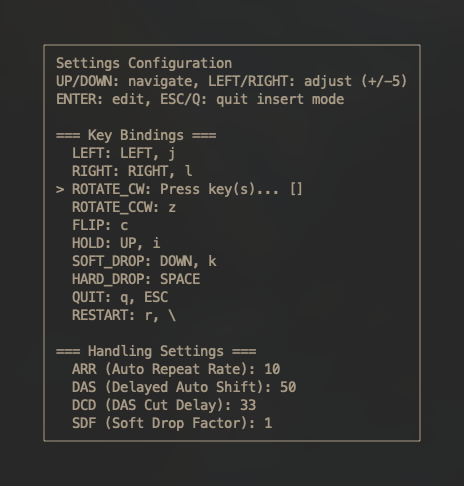

<div align="center">

# 🎮 clitris

**A minimalistic, high-fidelity, guideline Tetris implementation for the command line**

[](https://github.com/FinityFly/clitris/releases)
[](https://github.com/FinityFly/clitris/actions)
[](LICENSE)
[](https://github.com/FinityFly/clitris)

[](https://github.com/FinityFly/clitris/releases)
[](https://github.com/FinityFly/clitris/stargazers)
[](https://github.com/FinityFly/clitris/issues)

[**🚀 Quick Start**](#-installation) • [**📖 Documentation**](#-controls) • [**🎮 Demo**](#-demo) • [**🤝 Contributing**](#-contributing)

---

<table width="100%">
  <tr>
    <td width="50%" align="center">
      
      <br><strong>🎮 Gameplay</strong>
    </td>
    <td width="50%" align="center">
      
      <br><strong>⚙️ Settings</strong>
    </td>
  </tr>
</table>

</div>

## 📋 Table of Contents

- [🎮 clitris](#-clitris)
  - [📋 Table of Contents](#-table-of-contents)
  - [🔍 About](#-about)
    - [✨ Features](#-features)
  - [🎬 Demo](#-demo)
  - [🚀 Installation](#-installation)
    - [🍺 Homebrew (Recommended)](#-homebrew-recommended)
    - [🐧 Linux/macOS](#-linuxmacos)
  - [🎯 Quick Start](#-quick-start)
  - [🎮 Controls](#-controls)
  - [⚙️ Configuration](#️-configuration)
  - [🏗️ Building](#️-building)
    - [Prerequisites](#prerequisites)
    - [Build](#build)
  - [🧹 Uninstall](#-uninstall)
    - [🍺 Homebrew](#-homebrew)
    - [🐧 Linux/macOS](#-linuxmacos-1)
  - [🤝 Contributing](#-contributing)
  - [📄 License](#-license)

## 🔍 About

clitris is a professional-grade Tetris implementation for the terminal, featuring modern guideline Tetris and competitive gameplay mechanics. I was slightly irritated by the lack of high-quality yet minimal terminal tetris clones and decided to do something about it. Enjoy!

### ✨ Features

- **🎯 Guideline Compliant**: SRS rotation system, official scoring, standard TETR.IO-like mechanics
- **⚡ Performance Optimized**: 60 FPS gameplay with sub-millisecond input response  
- **🔧 Highly Configurable**: Customizable handling (ARR/DAS/DCD/SDF) and keybind settings
- **🎮 4 Game Modes**: Sprint, Blitz, Zen, and Cheese Race
- **🎨 Clean and Modern Terminal UI**: Minimalist guideline tetris design with ghost piece, hold and next piece windows, and live stats display

## 🎬 Demo

```
Demo vid will exist soontm!
```

## 🚀 Installation

### 🍺 Homebrew (Recommended)

```bash
# Install
brew install FinityFly/tap/clitris

# Upgrade
brew upgrade clitris
```

### 🐧 Linux/macOS
```bash
curl -fsSL https://raw.githubusercontent.com/FinityFly/clitris/main/install.sh | bash
```

## 🎯 Quick Start

```bash
clitris  # or ./clitris if built locally
```

## 🎮 Controls

| Movement | Keys | Rotation | Keys |
|----------|------|----------|------|
| Left | `←` `j` | Rotate CW | `x` |
| Right | `→` `l` | Rotate CCW | `z` |
| Soft Drop | `↓` `k` | 180° Rotate | `c` |
| Hard Drop | `Space` | Hold | `↑` `i` |

**System:** `r` Restart • `q` `Esc` Quit

## ⚙️ Configuration

| Setting | Description | Default |
|---------|-------------|---------|
| **ARR** | Auto Repeat Rate | 33ms |
| **DAS** | Delayed Auto Shift | 100ms |
| **DCD** | DAS Cut Delay | 0ms |
| **SDF** | Soft Drop Factor | 1ms |

Access via `[5] Settings` in the main menu.

## 🏗️ Building

### Prerequisites
- C++17 compiler
- ncurses library  
- make

### Build
```bash
git clone https://github.com/FinityFly/clitris.git
cd clitris && make
sudo mv clitris /usr/local/bin/clitris  # optional
```

## 🧹 Uninstall

### 🍺 Homebrew
```bash
brew uninstall FinityFly/tap/clitris
```

### 🐧 Linux/macOS
```bash
sudo rm /usr/local/bin/clitris
```

## 🤝 Contributing

Contributions welcome! Please check [Issues](https://github.com/FinityFly/clitris/issues) or submit a PR.

## 📄 License

MIT License - see [LICENSE](LICENSE) for details.
